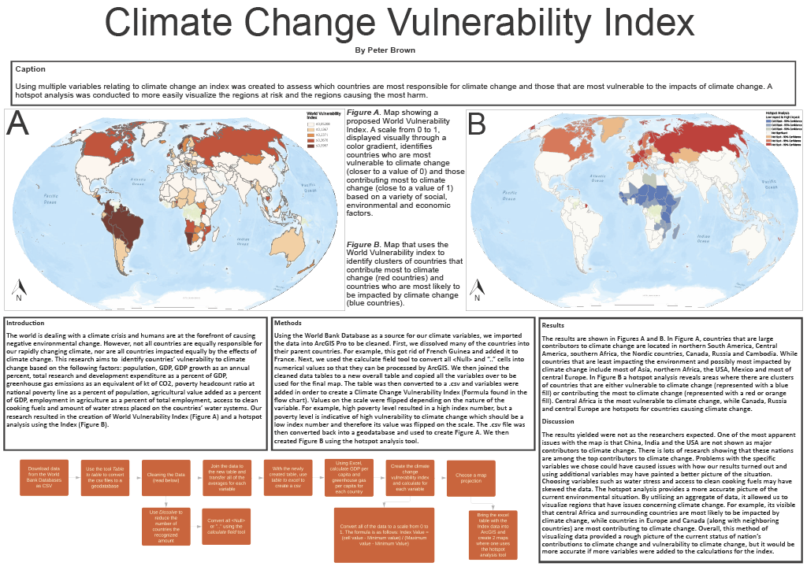
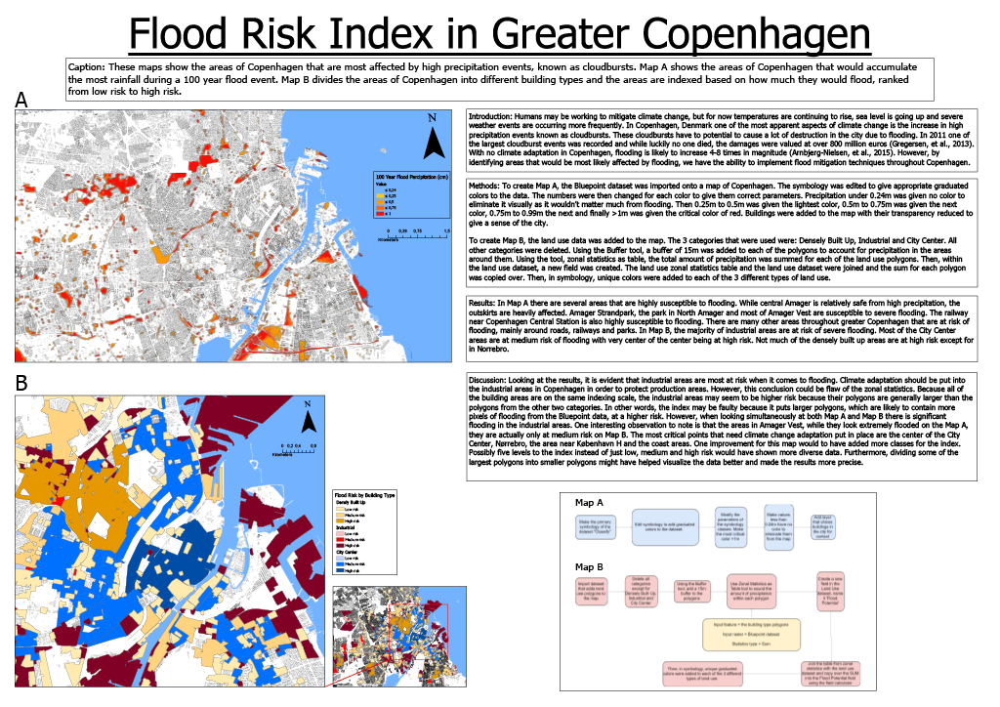

# Peter N Brown
  
## Climate Change Vulnerability Index

[Click to view above map.](https://drive.google.com/file/d/1EZlmB8gc67XfuUuhn6bpVCvMRWYxksFi/view?usp=sharing) Download PDF in link for best viewing experience.    
 

## Reducing the Effects of Copenhagen's Heat Island Using Vegetation Analysis

[Click to view above map.](https://drive.google.com/file/d/1wlJ_b3_ZZu1I4PU1r6GggtNxKPFUsFTY/view?usp=sharing) Download PDF in link for best viewing experience.     
 

## Flood Risk Index in Greater Copenhagen

[Click to view above map.](https://drive.google.com/file/d/1Na_m9gFR_gixzAfEMuKs3uV5pF16HsXe/view?usp=sharing) Download PDF in link for best viewing experience.   
