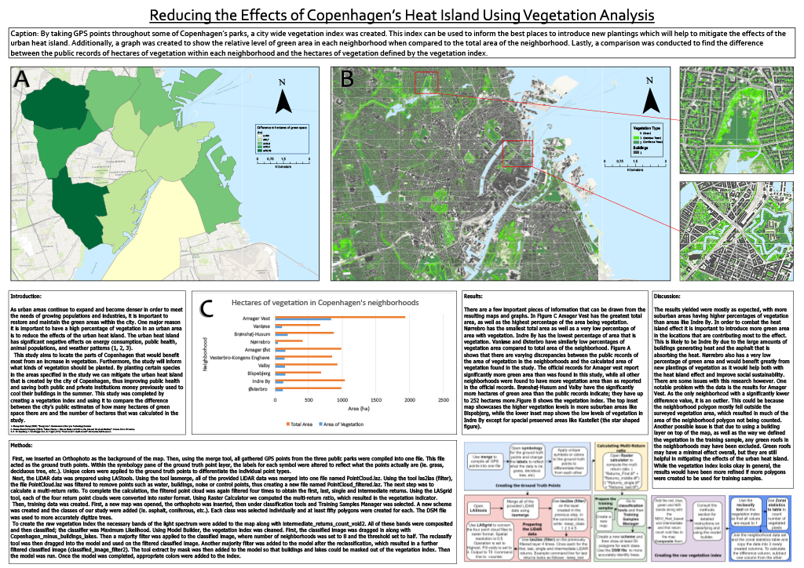

## Peter N Brown
  
### Climate Change Vulnerability Index

[Click to view Map 1](https://drive.google.com/file/d/1EZlmB8gc67XfuUuhn6bpVCvMRWYxksFi/view?usp=sharing)     
 

### Reducing the Effects of Copenhagen's Heat Island Using Vegetation Analysis
  

[Click to view Map 2](https://drive.google.com/file/d/1wlJ_b3_ZZu1I4PU1r6GggtNxKPFUsFTY/view?usp=sharing)     
 

### Flood Risk Index in Greater Copenhagen
  

[Click to view Map 3](https://drive.google.com/file/d/1Na_m9gFR_gixzAfEMuKs3uV5pF16HsXe/view?usp=sharing)   
